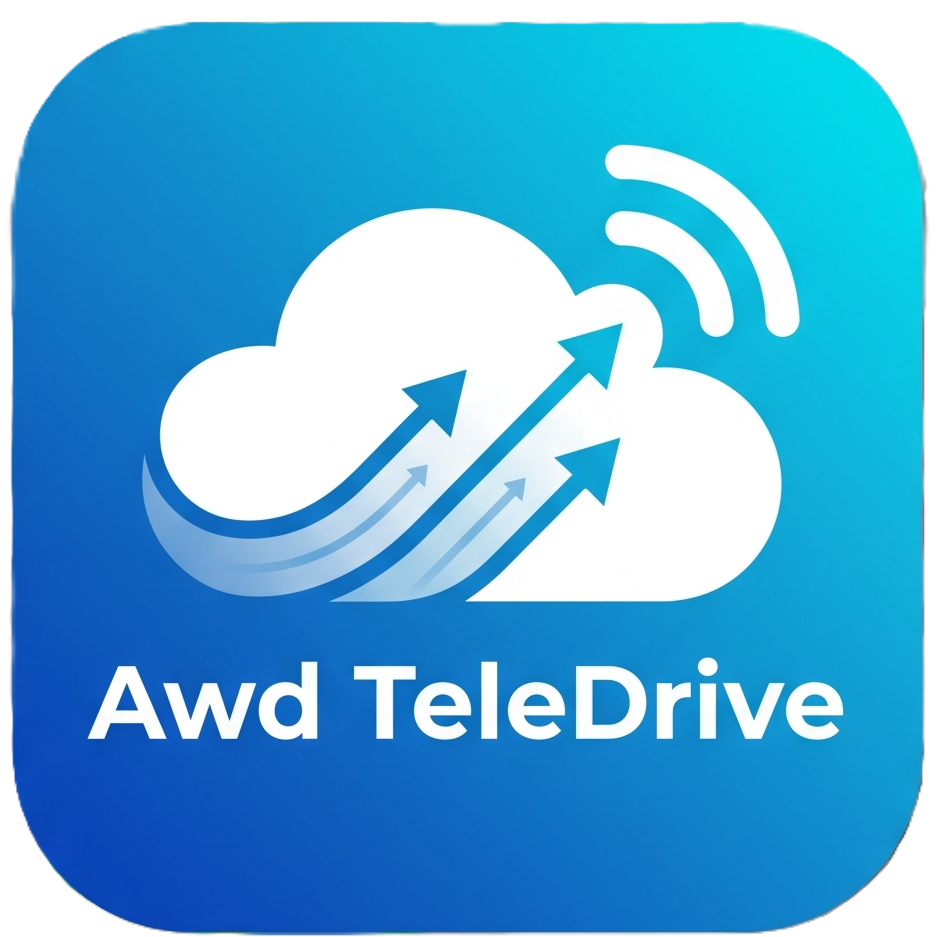
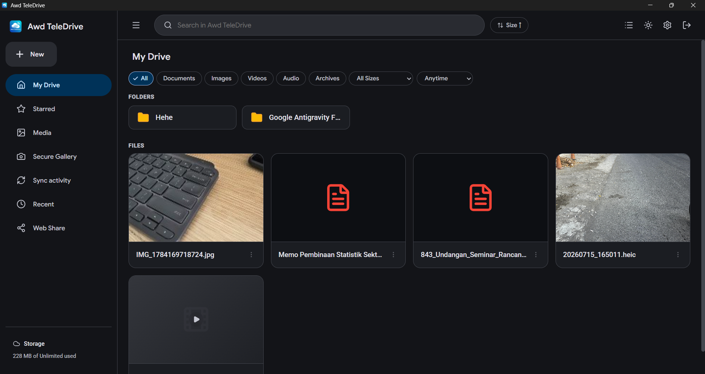
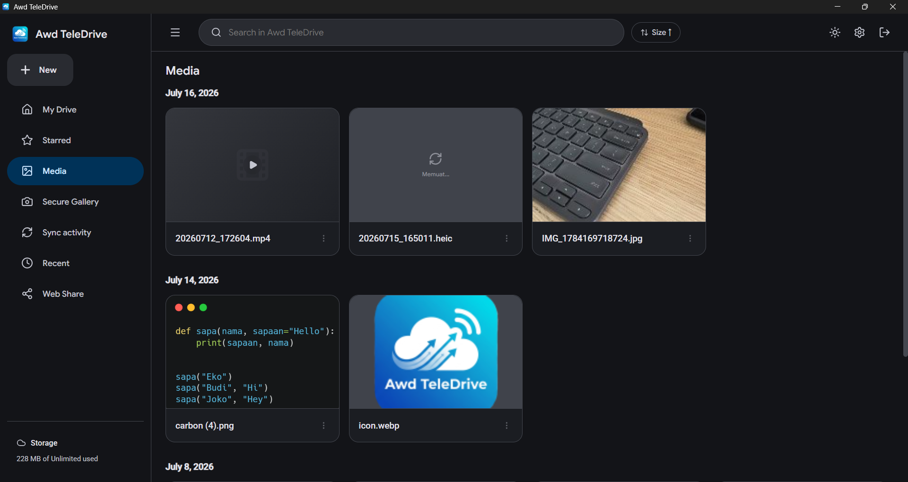
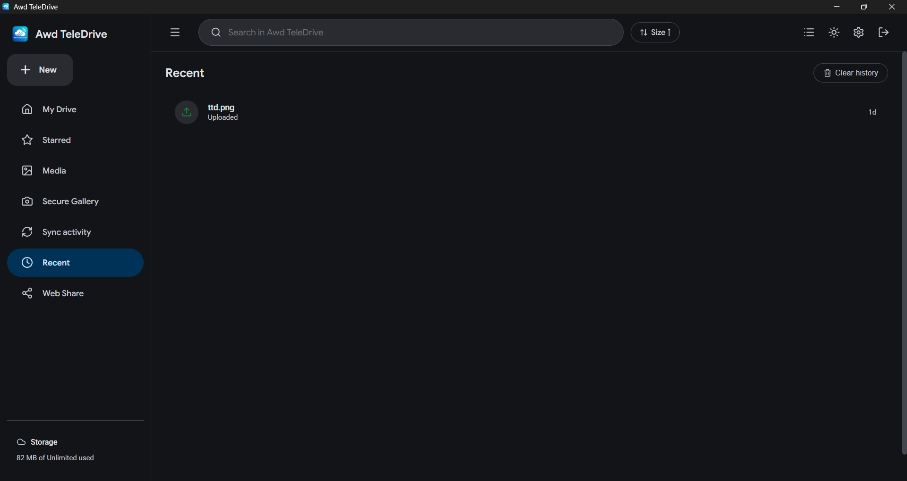
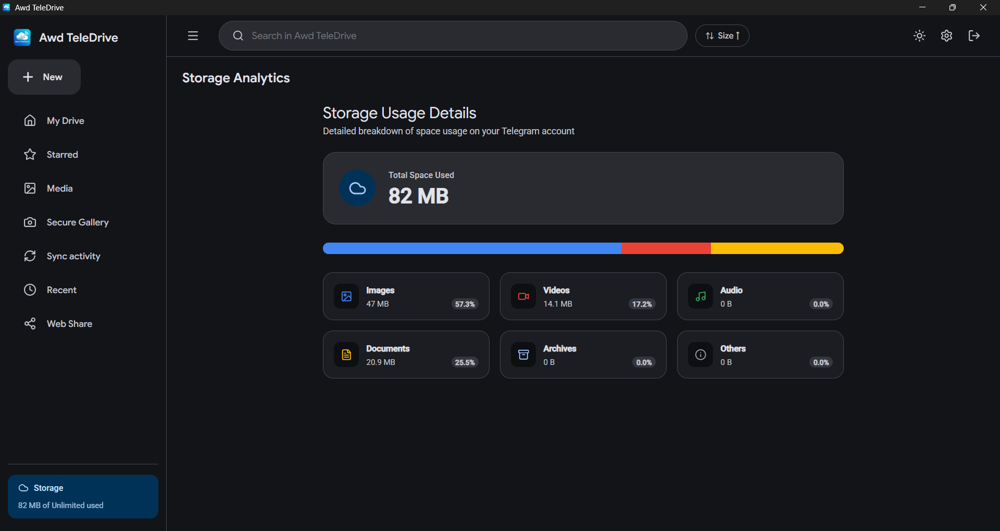
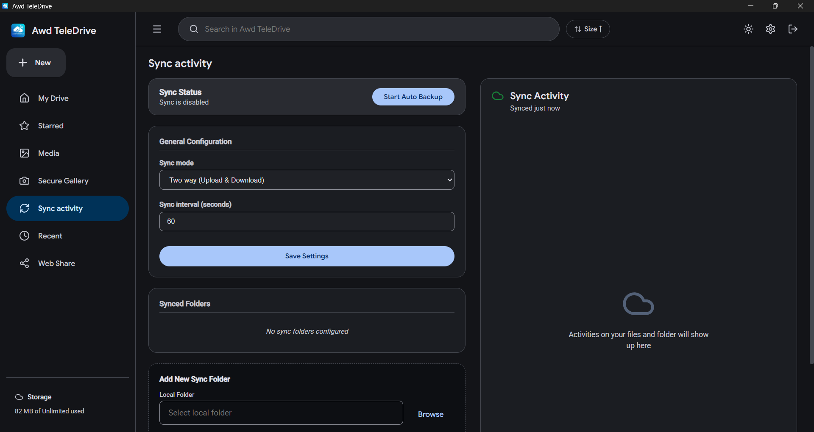
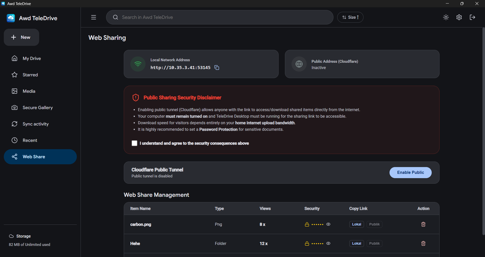

# awd-teledrive-desktop 💻☁️🚀

<p align="center">
  
</p>

<p align="center">
  <a href="https://github.com/putuwahyu29/awd-teledrive-desktop/blob/main/LICENSE">
    
  </a>
  
  
  
  
</p>

**awd-teledrive-desktop** adalah aplikasi desktop lintas platform berkinerja tinggi yang kaya fitur untuk mengubah akun Telegram Anda menjadi penyimpanan cloud pribadi tak terbatas yang aman. Dibangun dengan framework modern **Wails (Go)** dan **React/Vite (TypeScript)**, awd-teledrive-desktop menyajikan antarmuka desktop native yang menawan serta alur sinkronisasi media dan penanganan berkas latar belakang yang canggih.

---

## 🌐 Ekosistem Teledrive
Aplikasi ini merupakan bagian dari ekosistem lintas platform yang dirancang untuk menjadikan Telegram sebagai penyimpanan cloud pribadi Anda:
*   **📱 [awd-teledrive-android](https://github.com/putuwahyu29/awd-teledrive-android)**: Manajer file dan alat pencadangan Android yang aman.
*   **💻 [awd-teledrive-desktop](https://github.com/putuwahyu29/awd-teledrive-desktop)**: Klien desktop Wails (Go) + React berkinerja tinggi dengan sinkronisasi dua arah, dekripsi lokal, dan Berbagi Web via Cloudflare.
*   **📸 [awd-telephoto-android](https://github.com/putuwahyu29/awd-telephoto-android)**: Aplikasi pendamping untuk pencadangan foto/video terenkripsi di sisi klien.

---

## 🌐 Language / Bahasa
*   [English Version (Main)](README.md)
*   [Versi Bahasa Indonesia](README.id.md)

---

## 📌 Daftar Isi
- [✨ Fitur Utama](#-fitur-utama)
- [📷 Cuplikan Layar](#-cuplikan-layar)
- [📊 Matriks Perbandingan Fitur](#-matriks-perbandingan-fitur)
- [📁 Lokasi Penyimpanan & Path](#-lokasi-penyimpanan--path)
- [🚀 Panduan Penggunaan](#-panduan-penggunaan)
  - [Prasyarat](#prasyarat)
  - [Cara Mendapatkan Kredensial API Telegram](#cara-mendapatkan-kredensial-api-telegram)
  - [Proses Login](#proses-login)
  - [Berbagi File via Web & Cloudflare Tunnel](#berbagi-file-via-web--cloudflare-tunnel)
  - [Sinkronisasi Folder (Satu-Arah & Dua-Arah)](#sinkronisasi-folder-satu-arah--dua-arah)
  - [Galeri Media Terenkripsi Telephoto](#galeri-media-terenkripsi-telephoto)
- [🛠️ Panduan Pengembangan (Developer)](#-panduan-pengembangan-developer)
  - [Struktur Direktori Proyek](#struktur-direktori-proyek)
  - [Menjalankan Mode Development](#menjalankan-mode-development)
  - [Melakukan Build Produksi](#melakukan-build-produksi)
- [⚙️ Penyelesaian Masalah & Log](#-penyelesaian-masalah--log)
- [⚠️ Disclaimer](#️-disclaimer)
- [📄 Lisensi](#-lisensi)

---

## ✨ Fitur Utama

*   **☁️ Penyimpanan Cloud Telegram Tanpa Batas**: Unggah, unduh, dan kelola file dalam ukuran apa pun tanpa batasan kuota dengan memanfaatkan infrastruktur cloud Telegram.
*   **🔒 Autentikasi Aman & Asli**: Masuk langsung menggunakan API resmi Telegram melalui Nomor Telepon, kode OTP, dan kata sandi Verifikasi 2 Langkah (2FA).
*   **📁 Manajemen Folder yang Pintar**: Membuat dan mengatur direktori file. Folder dipetakan secara otomatis ke Channel atau Grup Telegram di balik layar untuk menjaga kerapian data.
*   **🔄 Sinkronisasi Folder Otomatis**: Hubungkan folder lokal PC dengan Chat/Channel Telegram pilihan Anda.
    *   **Sinkronisasi Satu-Arah (One-Way)**: Pencadangan aman dari folder lokal ➡️ cloud (hanya upload).
    *   **Sinkronisasi Dua-Arah (Two-Way)**: Sinkronisasi penuh secara timbal balik. Perubahan file (tambah, edit, hapus) di PC maupun Telegram akan diselaraskan di kedua sisi.
    *   **Pemantauan Real-time**: Lacak kecepatan unggah/unduh dan aktivitas proses sinkronisasi secara langsung melalui Log Aktivitas.
*   **🌐 Berbagi File via Jaringan Lokal & Publik**: Share file/folder dengan orang lain secara mudah.
    *   **Jaringan Lokal**: Bagikan tautan unduh menggunakan IP lokal komputer Anda.
    *   **Akses Publik**: Integrasi otomatis dengan **Cloudflare Tunnel (`trycloudflare.com`)** yang menghasilkan tautan publik gratis tanpa konfigurasi port-forwarding yang rumit.
    *   **Proteksi Password**: Lindungi file yang dibagikan dengan kata sandi tambahan.
    *   **Unduhan ZIP**: Mengunduh seluruh isi folder secara instan dalam format `.zip`.
*   **🖼️ Galeri Media Terenkripsi Telephoto**:
    *   Menampilkan foto dan video yang diurutkan rapi berdasarkan tanggal.
    *   Fitur dekripsi lokal untuk file media yang dienkripsi menggunakan metode AES-256-GCM + PBKDF2 (seperti hasil backup aplikasi mobile companion `awd-telephoto-android`).
*   **⚙️ Integrasi Windows Native**: Dukungan berjalan di latar belakang (system tray), opsi meminimalkan ke tray saat jendela ditutup, dan fitur auto-start saat Windows booting (melalui Registry Windows).

---

## 📷 Cuplikan Layar

| | |
|:---:|:---:|
| <br/>**Dasbor Utama / Manajer File** | <br/>**Galeri & Pemutar Media** |
| <br/>**File Terbaru & Aktivitas** | <br/>**Analisis Penyimpanan** |
| <br/>**Pengelola Sinkronisasi Folder** | <br/>**Berbagi Web via Cloudflare Tunnel** |

---

## 📊 Matriks Perbandingan Fitur

| Fitur | 📱 awd-teledrive-android | 💻 awd-teledrive-desktop | 📸 awd-telephoto-android |
| :--- | :---: | :---: | :---: |
| **Penyimpanan Cloud Tanpa Batas** | Ya (Hingga 2GB per file) | Ya (Ukuran file tidak terbatas) | Ya (Foto & Video) |
| **Manajer File & Folder** | Ya | Ya | Tampilan Galeri saja |
| **Mode Sinkronisasi / Backup** | Pencadangan folder lokal | Sinkronisasi Satu & Dua Arah | Pencadangan Foto/Video otomatis |
| **Keamanan / Enkripsi** | Master Password, Biometrik | Dekripsi AES-256 (Telephoto) | AES-256-GCM sisi Klien |
| **Berbagi Web (Publik/Lokal)** | Tidak | Ya (Cloudflare Tunnel & IP Lokal) | Tidak |
| **Integrasi Sistem Native** | WorkManager Android | System Tray, Auto-Launch (Registry) | WorkManager Android |
| **Dukungan Multi-Bahasa** | Ya (EN / ID) | Ya (EN / ID) | Ya (EN / ID) |

---

## 📁 Lokasi Penyimpanan & Path

Semua file konfigurasi, data sesi, dan cache media disimpan secara lokal pada direktori konfigurasi pengguna spesifik platform (menggunakan `os.UserConfigDir()` yang mengarah ke `%APPDATA%` pada Windows, `~/.config` pada Linux, dan `~/Library/Application Support` on macOS):

*   **File Konfigurasi**: `<UserConfigDir>/teledrive/config.json` (Menyimpan kredensial API, daftar tugas sinkronisasi, dan preferensi aplikasi).
*   **Sesi Telegram**: `<UserConfigDir>/teledrive/session.json` (Menyimpan status sesi Telegram yang terenkripsi agar pengguna tidak perlu login ulang).
*   **Registri Berbagi Web**: `<UserConfigDir>/teledrive/web_shares.json` (Mencatat daftar file yang dibagikan, kata sandi, dan statistik jumlah akses).
*   **Cache Media Telephoto**: `<UserConfigDir>/teledrive/telephoto_cache/` (Tempat penyimpanan sementara hasil dekripsi foto/video).
*   **Biner Cloudflare**: `<UserConfigDir>/teledrive/bin/cloudflared` (Ditambahkan ekstensi `.exe` pada Windows; diunduh otomatis saat fitur berbagi publik pertama kali diaktifkan).

---

## 🚀 Panduan Penggunaan

### Prasyarat
Untuk menggunakan aplikasi desktop yang telah di-build, cukup klik ganda file executable `teledrive.exe`. Tidak diperlukan instalasi driver tambahan.

### Cara Mendapatkan Kredensial API Telegram
awd-teledrive-desktop membutuhkan API ID & API Hash Anda sendiri untuk terhubung ke server Telegram secara aman. Ikuti langkah mudah berikut (gratis, ~2 menit):
1. Buka situs [my.telegram.org](https://my.telegram.org/) dan masuk menggunakan nomor Telegram Anda.
2. Pilih menu **API development tools**.
3. Isi formulir pembuatan aplikasi baru (Judul dan nama singkat bebas sesuai keinginan).
4. Salin nilai **App api_id** dan **App api_hash**.
5. Masukkan nilai tersebut pada tab Pengaturan (Settings) di aplikasi awd-teledrive-desktop.

> [!NOTE]
> Informasi kredensial API ini disimpan sepenuhnya di PC lokal Anda. Aplikasi ini berkomunikasi langsung ke server resmi Telegram (`dcs.Prod()`) tanpa perantara pihak ketiga.

### Proses Login
1. Buka aplikasi dan masukkan **API ID** dan **API Hash** Anda.
2. Ketik nomor telepon Telegram Anda dalam format internasional (contoh: `+628123456789`).
3. Klik **Send Code**. Kode verifikasi resmi akan dikirim oleh Telegram ke akun/SMS Anda.
4. Masukkan kode verifikasi yang Anda terima. Jika akun Anda memiliki Verifikasi 2 Langkah (2FA), masukkan kata sandi Anda pada kolom yang disediakan.

### Berbagi File via Web & Cloudflare Tunnel
Untuk membagikan file atau folder:
1. Klik kanan atau pilih opsi bagikan (share) pada file/folder di File Manager.
2. Tentukan kata sandi pengaman jika diperlukan.
3. Klik **Enable Public Sharing**. Aplikasi akan mengaktifkan Cloudflare Tunnel secara otomatis dan memberikan tautan publik aman (contoh: `https://xxx.trycloudflare.com/share/yyy`).
4. Penerima tautan dapat mengunduh file secara langsung, memutar video di browser, atau mengunduh satu folder penuh sekaligus dalam format `.zip`.

### Sinkronisasi Folder (Satu-Arah & Dua-Arah)
1. Buka tab **Sync Manager**.
2. Klik **Add Task** dan pilih folder lokal di komputer Anda.
3. Masukkan ID Chat/Channel Telegram tujuan.
4. Pilih metode sinkronisasi:
   * **Satu-Arah (One-Way)**: Hanya mengunggah file baru dari PC ➡️ Telegram.
   * **Dua-Arah (Two-Way)**: Menyelaraskan isi folder secara timbal balik. Jika Anda menambah/menghapus file di PC maupun Telegram, keduanya akan disesuaikan.
5. Atur interval waktu pengecekan (default: 60 detik).
6. Aktifkan tugas. Proses latar belakang akan berjalan otomatis sesuai jadwal.

### Galeri Media Terenkripsi Telephoto
Jika Anda menggunakan pencadangan foto/video terenkripsi dari perangkat seluler:
1. Masuk ke tab **Telephoto**.
2. Masukkan kata sandi dekripsi Anda.
3. Galeri akan menampilkan foto dan video secara instan. File sementara yang terdekripsi disimpan di folder cache lokal dan dapat dibersihkan kapan saja dengan menekan tombol **Clear Cache**.

---

## 🛠️ Panduan Pengembangan (Developer)

### Struktur Direktori Proyek
```
awd-teledrive-desktop/
├── app.go                  # Logika aplikasi Wails utama dan binding lifecycle
├── app_auth.go             # Alur autentikasi Telegram (gotd: Telepon, OTP, 2FA, QR Login)
├── app_config.go           # Konfigurasi aplikasi lokal & pengaturan startup registri Windows
├── app_files.go            # Penyimpanan berkas & folder inti, upload/download, dan pelacak progress
├── app_sync.go             # Orkestrasi manajer sinkronisasi (sinkronisasi latar belakang Satu & Dua Arah)
├── main.go                 # Entry point aplikasi Go
├── telephoto.go            # Dekripsi media lokal PBKDF2 & AES-256-GCM serta pembantu galeri
├── tray.go                 # Integrasi system tray Windows
├── web_server.go           # Server web lokal & peluncur Cloudflare Tunnel
├── web_handlers.go         # Handler HTTP untuk tautan berbagi publik, streaming, dan unduhan batch
├── web_templates.go        # Templat HTML/CSS bawaan untuk halaman web berbagi
├── go.mod                  # Dependensi modul Go
├── go.sum                  # Checksum modul Go
├── icon.webp               # Ikon aplikasi yang di-embed ke web server
├── wails.json              # File konfigurasi proyek Wails
├── build/                  # Aset kompilasi Wails dan biner keluaran
└── frontend/               # Aplikasi frontend React + Vite + TypeScript
```

### Menjalankan Mode Development
Untuk menjalankan proyek secara lokal dengan fitur hot-reload otomatis:

1. **Pasang dependensi**:
   Pastikan Anda telah menginstal [Go](https://go.dev) (1.18+), [Node.js](https://nodejs.org), dan [Wails CLI](https://wails.io/docs/gettingstarted/installation).
   ```bash
   # Pasang Wails CLI jika belum ada
   go install github.com/wailsapp/wails/v2/cmd/wails@latest
   ```
2. **Jalankan server dev**:
   ```bash
   wails dev
   ```

### Melakukan Build Produksi
awd-teledrive-desktop mendukung lintas platform secara penuh dan dapat dikompilasi menjadi file binary yang dioptimalkan atau paket instalasi untuk Windows, macOS, dan Linux.

#### 1. File Hasil Kompilasi
*   **Windows**: `build/bin/awd-teledrive.exe`
*   **macOS**: `build/bin/awd-teledrive.app` (App Bundle)
*   **Linux**: `build/bin/awd-teledrive`

#### 2. Kompilasi Produksi
Kompilasi biner produksi untuk OS saat ini:
```bash
wails build -clean -ldflags "-s -w"
```

#### 3. Kompilasi Lintas Platform (Cross-Compilation)
```bash
# Build untuk Windows
wails build -platform windows/amd64

# Build untuk macOS (Darwin Universal/Intel/Apple Silicon)
wails build -platform darwin/universal

# Build untuk Linux
wails build -platform linux/amd64
```

#### 4. Membuat Paket Installer / Setup
*   **Windows Setup Installer (NSIS)**:
    Memerlukan [NSIS](https://nsis.sourceforge.io/) terpasang pada Windows path Anda. Jalankan:
    ```bash
    wails build -nsis
    ```
    Perintah ini menghasilkan sebuah setup installer executable tunggal `build/bin/awd-teledrive-setup.exe`.

---

## ⚙️ Penyelesaian Masalah & Log

*   **Error Webview**: Pastikan Windows Anda telah terinstal WebView2 runtime (terpasang secara bawaan di Windows 10/11).
*   **Koneksi Gagal**: Jika klien Telegram Anda gagal terhubung, periksa konektivitas internet Anda, pengaturan firewall, atau pastikan nilai `api_id` dan `api_hash` di `%APPDATA%\teledrive\config.json` sudah benar.
*   **Reset Status Aplikasi**: Untuk logout sepenuhnya dan mereset aplikasi, hapus direktori `%APPDATA%\teledrive\`.

---

## ⚠️ Disclaimer

Proyek ini adalah pengembangan sumber terbuka independen yang dibuat semata-mata untuk tujuan pembelajaran dan edukasi. Proyek ini tidak berafiliasi, dikaitkan, diizinkan, didukung oleh, atau dengan cara apa pun terhubung secara resmi dengan Telegram Messenger atau perusahaan/pihak lainnya.

Pengguna bertanggung jawab penuh atas segala tindakan dan kepatuhan terhadap Ketentuan Layanan Telegram serta hukum setempat maupun internasional yang berlaku. Pengembang tidak bertanggung jawab atas penyalahgunaan, pelanggaran kebijakan, pemblokiran akun, atau konsekuensi hukum apa pun yang timbul dari penggunaan perangkat lunak ini.

---

## 📄 Lisensi

Proyek ini dilisensikan di bawah MIT License. Lihat berkas [LICENSE](LICENSE) untuk teks lisensi selengkapnya.

---

<p align="center">Dibuat dengan ❤️ oleh <a href="mailto:aguswahyu@office.awd.my.id">I Putu Agus Wahyu Dupayana</a></p>
